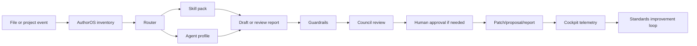

# Agent Skills Competitive Research

Date: 2026-07-04

Purpose: identify what AuthorOS should absorb from the strongest current agent customization systems, then translate those lessons into engineering requirements for authoring teams.

## Executive Summary

The strongest systems do not rely on one mega-prompt. They layer context:

1. **Always-on instructions** for project rules, standards, and locked context.
2. **On-demand skills** for specialized procedures with scripts, references, examples, and templates.
3. **Custom agents/subagents** for durable roles with scoped tools and model choices.
4. **Hooks/guardrails** for deterministic checks that should not depend on model judgment.
5. **MCP/tools** for structured access to project data, files, external systems, and memory.
6. **Workflows/playbooks** for manual, repeatable multi-step processes.
7. **Telemetry/evals** for seeing what happened, scoring output, and improving standards.

AuthorOS should absorb this as a layered authoring control plane:

```text
AGENTS.md / AUTHORING_STANDARD.md
  -> authoring skills
  -> authoring team agents
  -> hooks and quality gates
  -> MCP and cockpit reports
  -> council evals and standards updates
```

## Sources Reviewed

| System | Source | Relevant primitive |
|---|---|---|
| GitHub Copilot | https://docs.github.com/en/copilot/how-tos/copilot-on-github/customize-copilot/customize-cloud-agent/create-custom-agents | Custom agent profiles with YAML frontmatter, tool scopes, MCP configuration, model hints, org-level distribution |
| GitHub Copilot CLI | https://docs.github.com/en/copilot/how-tos/copilot-cli/customize-copilot/add-skills | Agent skills as `SKILL.md` folders with scripts/resources, project and personal install locations |
| GitHub Copilot instructions | https://docs.github.com/en/copilot/how-tos/copilot-on-github/customize-copilot/add-custom-instructions/add-repository-instructions | `AGENTS.md`, path instructions, repository-wide and path-specific guidance |
| VS Code | https://code.visualstudio.com/docs/agent-customization/agent-skills | Agent skills as portable folders; skills vs instructions; on-demand task expertise |
| VS Code | https://code.visualstudio.com/docs/agent-customization/custom-agents | Custom agents with handoffs for plan -> implement -> review workflows |
| Claude Code | https://code.claude.com/docs/en/skills | Skills, nested skill availability, progressive context loading |
| Claude Code | https://code.claude.com/docs/en/hooks | Lifecycle hooks, PreToolUse/PostToolUse, scoped hooks in skills/subagents |
| OpenAI Agents SDK | https://developers.openai.com/api/docs/guides/agents | Application-owned orchestration, state, approvals, tools, handoffs |
| OpenAI Agents SDK | https://openai.github.io/openai-agents-python/guardrails/ | Input, output, and tool guardrails; blocking guardrails for safety/cost |
| AGENTS.md | https://agents.md/ | Shared open instruction format for many coding agents |
| Devin/Cascade | https://docs.devin.ai/desktop/cascade/memories | Rules, memories, AGENTS.md, workflows, skills; durable rules over auto memories for shared knowledge |
| Devin/Cascade | https://docs.devin.ai/desktop/cascade/workflows | Manual slash-command workflows for repeatable sequences |
| Devin/Cascade | https://docs.devin.ai/desktop/cascade/mcp | MCP registry, admin controls, tool access |
| Cursor | https://cursor.com/changelog/1-0 | Background agents, project memories, MCP setup, BugBot review |
| Replit | https://docs.replit.com/references/project-setup/replit-dot-md | `replit.md` as project architecture/context generated and maintained by the agent |
| Jules | https://jules.google/docs/ | GitHub-integrated async coding tasks, planning before execution |
| Awesome Copilot | https://github.com/github/awesome-copilot | Large library of agents/skills/instructions for governance, evals, docs, orchestration |
| Anthropic skills examples | https://github.com/anthropics/skills | Production-style examples for document handling, design, testing, and artifact generation |

## What To Absorb

### 1. GitHub Copilot: Agent Profiles As Deployable Teammates

Absorb:

- `.agent.md` style profiles for named authoring teammates.
- Required `description` optimized for routing.
- Explicit `tools` allowlists so review agents cannot mutate files.
- Optional `model` field for environments that support it.
- Org-level packaging for shared Starlight authoring agents.

AuthorOS implementation:

- Generate `agents/*.agent.md` profiles from the AuthorOS authoring registry.
- Keep authoring agents small: `website-narrative-reviewer`, `offer-ethics-reviewer`, `claim-verifier`, `voice-editor`, `standards-curator`.
- Use model aliases in AuthorOS and emit provider-specific `model` only at install/export time.

### 2. GitHub/VS Code Skills: Portable Procedures, Not Prompt Soup

Absorb:

- Each skill has its own folder.
- `SKILL.md` contains frontmatter, trigger description, and body instructions.
- Scripts, examples, templates, rubrics, and references live with the skill.
- Skills are loaded on demand, reducing context noise.

AuthorOS implementation:

- Keep long writing craft in skill reference files, not global instructions.
- Put deterministic scripts beside skills where possible.
- Build initial skills:
  - `authoring-inventory`
  - `website-narrative-review`
  - `claim-verification`
  - `offer-positioning-review`
  - `council-synthesis`
  - `standards-curator`

### 3. AGENTS.md: Shared Instruction Anchor

Absorb:

- Use `AGENTS.md` for repo-level operating instructions that multiple agents can read.
- Use nested `AGENTS.md` for subproject-specific conventions.
- Keep human docs and agent docs separate.

AuthorOS implementation:

- `AGENTS.md` should point to `AUTHORING_PROJECT_BRIEF.md`, `AUTHORING_STANDARD.md`, locked files, and the relevant skill pack.
- Agents should be told: read locked state before rewriting; produce proposals for locked files; save reports under `reports/authoring`.

### 4. Claude Hooks And OpenAI Guardrails: Enforcement Outside The Model

Absorb:

- Do not rely on an LLM to remember every safety rule.
- Hooks can run at lifecycle events and before/after tool calls.
- Guardrails can block before expensive or risky execution.
- Tool guardrails matter when handoffs or subagents are involved.

AuthorOS implementation:

- Add deterministic checks for locked files, legal/claims changes, and unsourced numbers.
- Make broad rewrite commands fail closed unless scope and approval are explicit.
- Run cheap inventory/lint before frontier council review.

### 5. Cascade/Devin: Rules, Memories, Workflows, Skills

Absorb:

- Rules are better than memories for team-shared durable knowledge.
- Memories are useful but should not replace version-controlled truth.
- Workflows are manual slash-command procedures.
- Skills are best for complex reusable tasks with references and files.

AuthorOS implementation:

- Treat `BRAND_VOICE_LOCKED.md`, `POSITIONING_LOCKED.md`, and `LEGAL_CLAIMS_LOCKED.md` as version-controlled rules.
- Treat model memories as convenience only.
- Represent major authoring loops as workflows: inventory, review, council, proposal, approval, publish.

### 6. Cursor: Background Work Needs Strong Surface Area Control

Absorb:

- Background agents and remote execution are powerful, but they widen the attack and quality surface.
- Memory and MCP improve context, but need governance.
- PR review bots show the value of automatic review comments and fix handoffs.

AuthorOS implementation:

- Start background authoring work in read-only inventory mode.
- Require explicit approval for direct rewrite tasks.
- Turn council results into patch proposals, not silent changes.

### 7. OpenAI Agents SDK: Product-Owned Orchestration

Absorb:

- Real agent systems need application-owned state, tools, approvals, and traces.
- Handoffs and agents-as-tools are for specialist ownership.
- Evals/tracing are part of production, not an afterthought.

AuthorOS implementation:

- The cockpit should own the authoring queue and report status.
- Agent runs should emit structured events.
- Model aliases should resolve at runtime and be recorded in provenance.

## Skill Patterns Worth Copying From Awesome Copilot

These public skill/agent patterns are directly relevant:

| Pattern | Why it matters for AuthorOS |
|---|---|
| `agent-governance` | Policy objects, allowlists, blocked patterns, rate limits, audit trails |
| `agentic-eval` | Generate -> evaluate -> critique -> refine loops with score thresholds |
| `ai-team-orchestration` | Explicit roles, producer/dev/QA split, cross-chat handoff protocol |
| `documentation-writer` | Diataxis docs taxonomy and audience/goal/scope first |
| `doublecheck` agent | Claim extraction, source verification, adversarial review |
| `agent-governance-reviewer` | Tool governance, trust scoring, audit trails |
| `gem-orchestrator` family | Planner/researcher/reviewer split for coordinated agents |
| `quality-playbook` | Repeatable scoring and sign-off process |
| `create-agentsmd` | Standardized repo onboarding for agent instructions |

## Engineering Requirements For AuthorOS

### Data Model

AuthorOS needs these first-class report types:

- `authoring.inventory`
- `authoring.review`
- `authoring.council`
- `authoring.claims`
- `authoring.locked_state`
- `authoring.standards_drift`

### CLI

Minimum commands:

```bash
author-os authoring inventory --repo .
author-os authoring inventory --estate --lanes site,frankx
author-os authoring review --artifact <path> --team auto
author-os authoring claims --artifact <path>
author-os authoring council --artifact <path>
author-os authoring standards doctor
```

### Cockpit

Minimum panels:

- Estate writing inventory
- Active authoring queue
- Council reviews
- Claims ledger
- Locked state proposals
- Standards drift

### Governance

Rules:

- Read-only before rewrite.
- Locked files require proposal.
- Legal, claims, pricing, positioning, and canon require human approval.
- Cheap models can extract; frontier models/council handle strategy and final rewrite review.
- Every public artifact gets provenance and a rubric score.

## Recommended Architecture



## Research Verdict

AuthorOS should become stricter than the competitors in one specific way: it should separate **authoring truth**, **authoring procedure**, and **authoring execution**.

- Truth lives in locked, version-controlled project files.
- Procedure lives in skills, templates, workflows, and hooks.
- Execution lives in routed agent runs with audit trails.

This gives Starlight the good part of agent swarms without letting random models rewrite brand, legal, story canon, or strategic positioning.
