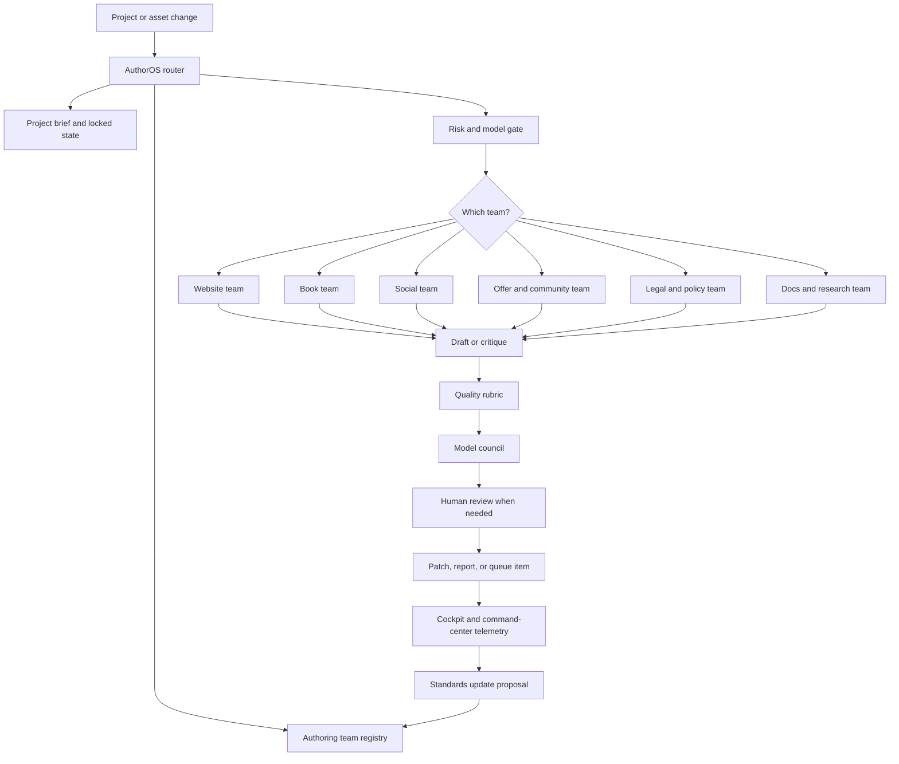
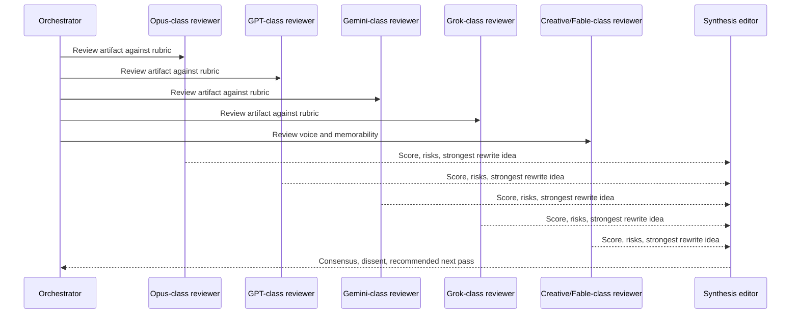

# Authoring Team Operating System

> A governed authoring swarm for websites, books, social, offers, legal copy, docs, community, and research.

This document extends the existing AuthorOS architecture with a cross-project authoring team layer. The goal is not "more writing agents." The goal is a durable system where the right authoring team is triggered for the right project, where lower-capability models cannot overwrite high-value thinking, and where standards improve through review, evidence, and model council feedback.

## Current Lessons From The Agent Market

The best current agent systems converge on a few patterns that AuthorOS should absorb.

| Source | What matters | What AuthorOS absorbs |
|---|---|---|
| GitHub Copilot custom agents | Agents are Markdown profiles with name, description, tools, MCP servers, model hints, and prompts. Org-level agents can live in `.github` or `.github-private` and apply across repositories. | Create AuthorOS custom agent profiles for authoring teams, with tool allowlists and project scopes. |
| GitHub Copilot agent skills | Skills are folders with `SKILL.md`, optional scripts/resources, provenance metadata, and on-demand loading based on descriptions. | Ship authoring skills as portable folders, not only long global prompts. |
| AGENTS.md standard | Agents read predictable repo guidance and nested instructions. GitHub Copilot and Jules support `AGENTS.md`; Codex also uses it for layered project instructions. | Keep `AGENTS.md` as the repo-level entrypoint, with AuthorOS pointing to deeper team standards. |
| Claude Code skills and hooks | Skills load only when needed, can run in forked subagents, can restrict tools/models, and hooks can run automatic checks around lifecycle events. | Use skills for authoring passes and hooks for quality gates, lock-file protection, and model-review feedback. |
| VS Code custom agents | Handoffs create guided workflows between specialist agents, preserving context and human approval between steps. | Express writing workflows as explicit handoff chains, not silent all-in-one rewrites. |
| Devin/Cascade | Memories and rules persist context; Playbooks make repeated procedures shareable and reusable. | Treat repeat writing processes as playbooks and keep durable memories separate from project truth files. |
| Replit Agent | `replit.md` captures project architecture, style, dependencies, and can evolve as a project changes. | Add an AuthorOS project brief that agents can update through review, never by hidden memory alone. |
| Jules | GitHub-integrated tasks produce a plan before code changes; issue labels can trigger background work. | Trigger authoring teams through issue labels, file patterns, queue tasks, and command-center actions. |
| OpenAI Agents SDK | Application-owned orchestration is for state, tools, approvals, runtime behavior, and eval loops. | Build AuthorOS orchestration as product logic, not a pile of prompt files. |
| Awesome Copilot and Anthropic skills | Public examples show reusable skills for governance, evals, docs, agent orchestration, PDF/DOCX/XLSX, brand, and web artifacts. | Mine patterns, but keep Starlight standards stricter, more opinionated, and more beautiful. |

Primary references:

- GitHub custom agents: https://docs.github.com/en/copilot/how-tos/copilot-on-github/customize-copilot/customize-cloud-agent/create-custom-agents
- GitHub agent skills: https://docs.github.com/en/copilot/how-tos/copilot-on-github/customize-copilot/customize-cloud-agent/add-skills
- GitHub agent skills concept: https://docs.github.com/en/copilot/concepts/agents/about-agent-skills
- GitHub repository instructions: https://docs.github.com/en/copilot/how-tos/copilot-on-github/customize-copilot/add-custom-instructions/add-repository-instructions
- VS Code agent skills: https://code.visualstudio.com/docs/agent-customization/agent-skills
- VS Code custom agents and handoffs: https://code.visualstudio.com/docs/agent-customization/custom-agents
- Claude Code skills: https://code.claude.com/docs/en/skills
- Claude Code hooks: https://code.claude.com/docs/en/hooks
- Codex `AGENTS.md`: https://developers.openai.com/codex/guides/agents-md
- OpenAI Agents SDK: https://developers.openai.com/api/docs/guides/agents
- OpenAI Agents guardrails: https://openai.github.io/openai-agents-python/guardrails/
- Devin Playbooks: https://docs.devin.ai/product-guides/creating-playbooks
- Devin/Cascade Memories and Rules: https://docs.devin.ai/desktop/cascade/memories
- Replit `replit.md`: https://docs.replit.com/references/project-setup/replit-dot-md
- Jules: https://jules.google/docs/
- Awesome Copilot: https://github.com/github/awesome-copilot
- Anthropic skills examples: https://github.com/anthropics/skills

## North Star

AuthorOS should become the estate-wide authoring intelligence layer:

1. It audits existing writing across the Starlight repo estate.
2. It classifies every artifact by domain, audience, risk, and quality standard.
3. It routes work to a dedicated authoring team.
4. It protects locked state, claims, canon, legal language, positioning, and brand voice.
5. It uses the best available model tier for high-impact thinking and final rewrites.
6. It records provenance, model review, scores, and unresolved risks.
7. It exposes progress and results to Starlight Command Center, Offer Command Center, and AuthorOS cockpit.

The writing standard is not static. It evolves through audits, scored examples, council disagreement, and the best human writing craft across technical docs, literature, brand strategy, legal precision, education, community building, and ethical influence.

## System Map



## Authoring Team Types

Each team is a durable unit with a clear domain, output format, model tier, and approval policy.

| Team | Trigger examples | Primary outputs | Required reviewers |
|---|---|---|---|
| Website Narrative Team | `app/**`, `pages/**`, `*.mdx`, landing pages, hero sections | Page messaging, hierarchy, UX copy, proof points, CTA language | Brand Voice, Web UX, Conversion Ethics |
| Offer Team | `offers/**`, product pages, pricing, sales decks | Offer narrative, positioning, value stack, objections, trust story | Strategy, Community Trust, Legal Claims |
| Community Team | cohort pages, challenge docs, social prompts, event copy | Invitations, challenges, community arcs, rituals, moderation tone | Community, Ethics, Brand Voice |
| Social Media Team | `social/**`, threads, posts, launch assets | Hooks, threads, captions, channel variants, experiment matrix | Attention, Brand Voice, Fact Check |
| Book Team | `chapters/**`, manuscripts, outlines, story bibles | Outline, draft critique, scene pass, continuity report, publication plan | Structure, Voice, Continuity |
| Documentation Team | `README`, `docs/**`, product docs, developer docs | Diataxis docs, guides, references, explanations | Technical Accuracy, User Goal |
| Research Team | dossiers, market maps, competitive research | Source-backed briefs, evidence tables, claim maps | Doublecheck, Strategy |
| Legal And Policy Team | `legal/**`, terms, disclosures, compliance, claims | Risk report, plain-language legal copy, citation map | Legal Precision, Human Approval |
| Brand Voice Team | brand packs, manifestos, about pages | Voice guide, vocabulary, tone boundaries, examples | Founder Voice, Editorial |
| Editorial Council | important final drafts and standard changes | Scorecard, rewrite recommendation, council dissent | Multi-model council |
| Standards Team | skills, rubrics, AGENTS.md, style guides | Updated standards, regression tests, eval prompts | Governance, Human Approval |

## Core Authoring Roles

The teams can share role primitives instead of creating too many isolated agents.

| Role | Purpose | Writes directly? | Model tier |
|---|---|---:|---|
| Orchestrator | Routes work, defines scope, creates handoffs, watches risk | No | Reasoning |
| Researcher | Finds current sources, extracts claims, builds evidence map | No | Search-capable reasoning |
| Strategist | Clarifies positioning, audience, promise, objections, market angle | Sometimes | Best reasoning |
| Architect | Structures argument, story, information flow, or page hierarchy | Sometimes | Best reasoning |
| Writer | Creates first draft within a clear brief | Yes | Best creative/writing |
| Voice Editor | Preserves brand/person/persona voice, rhythm, cadence, taste | Yes | Best creative/writing |
| Line Editor | Improves clarity, grammar, syntax, force, flow | Yes | Strong editor |
| Fact Checker | Verifies factual, technical, legal, and statistical claims | No | Search-capable verifier |
| Conversion Ethicist | Improves attention and trust without manipulation | Sometimes | Strategy/editor |
| Community Builder | Turns copy into belonging, challenge, momentum, participation | Sometimes | Strategy/creative |
| Legal Reviewer | Flags risk, jurisdiction, claims, disclosures | No, except plain-language drafts | Best legal-capable model plus human |
| Evaluator | Scores output against rubrics and writes residual risk notes | No | Best evaluator plus cheap checks |
| Standards Curator | Proposes updates to style, skills, rubrics, and examples | No | Council |

## Trigger Matrix

AuthorOS routing should use repo metadata, file paths, prompt intent, and risk tags.

| Signal | Team route | Notes |
|---|---|---|
| `authoros.json.type = "book"` | Book Team | Use AuthorOS story/canon memory and seven-pass ritual. |
| `repo-estate.control.json` lane `site` | Website Narrative Team | Apply Premium Web OS and design taste gates when visual surface matters. |
| Path contains `offers`, `pricing`, `sales`, `checkout` | Offer Team | Require Conversion Ethics and Legal Claims review. |
| Path contains `legal`, `terms`, `privacy`, `policy`, `compliance` | Legal And Policy Team | Human approval required before publishing. |
| Path contains `social`, `newsletter`, `threads`, `campaigns` | Social Media Team | Require channel-specific variants and experiment IDs. |
| Path contains `docs`, `README`, `guides`, `reference` | Documentation Team | Use Diataxis classification. |
| Prompt asks "rewrite", "improve", "make better" | Risk gate first | Require scope, diff target, locked-state read. |
| Prompt asks "research", "latest", "competitors", "best" | Research Team | Browse current sources and record links. |
| Prompt asks "make it more persuasive" | Offer or Community Team | Use ethical influence rubric, never dark patterns. |
| Prompt asks "audit all writing" | Audit Swarm | Read-only inventory first, no edits. |

## Model And Permission Gates

Model names change. AuthorOS should use stable model aliases and dynamically map them through Vercel AI Gateway, provider config, or local harnesses.

| Alias | Allowed work | Not allowed |
|---|---|---|
| `cheap-extractor` | Inventory, tagging, word counts, style lint, duplicate detection | Rewriting premium pages, legal claims, positioning |
| `fast-editor` | Grammar checks, simple clarity edits, summaries | Strategic rewrites, claims, legal, final brand copy |
| `creative-writer` | Drafts, hooks, scenes, voice variants, social candidates | Publishing without evaluation |
| `reasoning-architect` | Strategy, structure, offers, high-stakes decisions, contradictions | Bulk low-value extraction |
| `verifier` | Claim extraction, citations, legal/factual validation | Unverified creative rewriting |
| `council-seat` | Independent review, dissent, rubric scores | Direct writes to locked files |
| `human-required` | Legal, final positioning, brand constitution, destructive rewrites | Autonomous approval |

Do not hardcode a specific name such as `Opus 4.8`, `GPT-5.5`, `Gemini 3.1 Pro`, `Grok 4.3`, or `Fable` into durable policy until the available provider/model list is verified. Use aliases such as:

- `opus-class-council`
- `gpt-frontier-council`
- `gemini-frontier-council`
- `grok-frontier-council`
- `creative-fable-class`

The router resolves aliases to current model slugs at run time and records the chosen slug in the run ledger.

## Rewrite Authority

This is the main protection against low-quality agents damaging valuable writing.

| Tier | Operation | Who can do it | Required gate |
|---|---|---|---|
| 0 | Read, inventory, summarize | Any approved agent | No mutation |
| 1 | Comment, critique, score | Any approved reviewer | Source paths and rubric |
| 2 | Minor copy edit | `fast-editor` or better | Diff, no locked facts changed |
| 3 | Voice-preserving rewrite | `creative-writer` plus `voice-editor` | Before/after diff and quality score |
| 4 | Strategic rewrite | `reasoning-architect` plus council | Human approval for final |
| 5 | Legal, claims, pricing, positioning, canon lock | Specialist plus council | Human approval required |
| 6 | Standard evolution | Standards Team plus council | Decision record and version bump |

Locked files:

- `CANON_LOCKED.md`
- `POSITIONING_LOCKED.md`
- `LEGAL_CLAIMS_LOCKED.md`
- `BRAND_VOICE_LOCKED.md`
- `COMMUNITY_PROMISE_LOCKED.md`
- `AUTHORING_STANDARD.md`
- `WRITING_EVAL_RUBRIC.md`

Agents can propose changes to locked files by writing `*.proposal.md` and adding a report entry. They cannot directly mutate locked files unless the human explicitly asks for that exact operation.

## Writing Quality Rubric

Every important artifact should receive a 100 point score. Ship threshold depends on risk.

| Dimension | Points | What good looks like |
|---|---:|---|
| Truth and evidence | 15 | Claims are sourced, current, appropriately qualified. |
| Strategic clarity | 12 | The reader immediately understands the point, audience, stakes, and next step. |
| Intellectual depth | 12 | Shows synthesis, discrimination, judgment, and non-obvious insight. |
| Human voice | 10 | Sounds alive, specific, and intentional rather than generic. |
| Emotional resonance | 10 | Creates felt meaning, not only information. |
| Structure and flow | 10 | Ideas progress with tension, contrast, and resolution. |
| Style and grammar | 8 | Clean sentences, strong rhythm, no filler, no AI-ish repetition. |
| Brand fit | 8 | Matches the relevant Starlight, FrankX, Arcanea, or AuthorOS world. |
| Community and trust | 7 | Invites participation, challenge, and growth without coercion. |
| Ethical influence | 5 | Attention and persuasion are used as education and invitation. |
| Agent readability | 3 | Future agents can parse intent, provenance, and constraints. |

Ship gates:

- `90+`: premium ready, final human skim for high-stakes pages.
- `82-89`: good, run one focused improvement pass.
- `70-81`: useful draft, needs editor and strategy review.
- `<70`: do not publish; route to rewrite or restart.

## Council Loop

The model council is not a single output. It is a disagreement engine.



Council packet fields:

```json
{
  "artifactId": "site/frankx-home-hero",
  "artifactPath": "C:/Users/frank/starlight/repos/frankx.ai-vercel-website/...",
  "domain": "website",
  "risk": "brand-positioning",
  "sourceStateRead": [
    "AGENTS.md",
    "BRAND_VOICE_LOCKED.md",
    "POSITIONING_LOCKED.md"
  ],
  "reviewers": [
    "opus-class-council",
    "gpt-frontier-council",
    "gemini-frontier-council",
    "grok-frontier-council",
    "creative-fable-class"
  ],
  "rubricVersion": "authoring-quality-2026.07.v1",
  "requiredOutput": [
    "scores",
    "top_3_risks",
    "strongest_line",
    "weakest_line",
    "rewrite_recommendation",
    "dissent"
  ]
}
```

## Ethical Influence Standard

AuthorOS should use marketing psychology without becoming manipulative.

Allowed:

- Sharp hooks that open a real loop.
- Clear stakes and contrast.
- Epiphany stories that help people see themselves.
- Social proof when truthful and relevant.
- Challenges, competitions, rituals, and public commitments.
- Community identity that invites creators to grow.
- Confident positioning backed by real evidence and taste.
- Offers framed as transformation, education, and enablement.

Blocked:

- Fake scarcity.
- False income, health, legal, or status claims.
- Manufactured fear.
- Shame-based pressure.
- Hidden bait-and-switch.
- Fabricated testimonials or social proof.
- Claims that require proof but provide none.
- "Herd mentality" as coercion. Use belonging and momentum instead.

## Project Files To Add

Every serious authoring project should have:

```text
project/
  AGENTS.md
  authoros.json
  AUTHORING_PROJECT_BRIEF.md
  AUTHORING_STANDARD.md
  WRITING_EVAL_RUBRIC.md
  BRAND_VOICE_LOCKED.md
  POSITIONING_LOCKED.md
  LEGAL_CLAIMS_LOCKED.md
  reports/
    authoring/
      inventory.json
      council/
      evals/
      provenance.jsonl
```

`authoros.json` should include:

```json
{
  "authoring": {
    "domains": ["website", "offer", "social"],
    "brandPack": "frankx",
    "audience": ["AI-native creators", "founders", "builders"],
    "riskLevel": "brand-positioning",
    "defaultTeam": "website-narrative",
    "requiredReviewers": ["voice-editor", "strategy", "fact-checker"],
    "lockedFiles": [
      "BRAND_VOICE_LOCKED.md",
      "POSITIONING_LOCKED.md",
      "LEGAL_CLAIMS_LOCKED.md"
    ],
    "publishGate": {
      "minimumScore": 90,
      "humanApprovalRequired": true
    }
  }
}
```

## Command Center Integration

AuthorOS cockpit and Starlight Command Center should show authoring work as first-class operational state.

Required panels:

| Panel | Data |
|---|---|
| Estate Writing Inventory | Repos scanned, artifacts found, domain classification, stale files |
| Active Authoring Queue | Tasks, teams, model aliases, status, blockers |
| Council Reviews | Scores, dissent, final recommendations |
| Quality Trends | Score over time by repo, domain, brand, model |
| Locked State | Which files are locked, proposals pending, approval state |
| Claims Ledger | Factual/legal claims, sources, verification date, risk |
| Social Experiment Board | Hooks, posts, channels, metrics, winning patterns |
| Offer Board | Offers, promises, objections, proof, conversion/trust score |
| Standards Drift | Repos with missing or outdated authoring standards |

Minimum telemetry event:

```json
{
  "event": "authoring.review.completed",
  "artifactId": "example",
  "team": "website-narrative",
  "score": 87,
  "threshold": 90,
  "status": "needs-focused-pass",
  "modelAliases": ["gpt-frontier-council", "gemini-frontier-council"],
  "sources": ["https://example.com/source"],
  "createdAt": "2026-07-04T00:00:00Z"
}
```

## Swarm Rollout Plan

### Phase 0: Baseline Inventory

Goal: understand what exists before changing anything.

Tasks:

- Scan the estate manifest for site, authoring, offer, social, legal, and docs repos.
- Inventory Markdown, MDX, HTML, TSX page copy, README docs, offer files, legal files, social assets.
- Classify each artifact by domain, brand, audience, risk, and stale state.
- Produce `reports/authoring/inventory.json` and `reports/authoring/inventory.md`.

Do not edit writing in this phase.

### Phase 1: Standards Foundation

Goal: create the canonical standard.

Tasks:

- Create estate-level `AUTHORING_STANDARD.md`.
- Create `WRITING_EVAL_RUBRIC.md`.
- Create `AUTHORING_PROJECT_BRIEF.md` template.
- Create locked file templates for brand, positioning, claims, and community promise.
- Add `authoros.json` authoring schema extensions.

### Phase 2: Team Skills

Goal: make repeatable authoring work portable across agents.

Skills to build first:

- `authoring-inventory`
- `website-narrative-review`
- `offer-positioning-review`
- `social-hook-lab`
- `book-seven-pass-council`
- `claim-verification`
- `legal-copy-risk-review`
- `community-trust-builder`
- `voice-preserving-rewrite`
- `council-synthesis`
- `standards-curator`

Each skill should be a folder with:

```text
skill-name/
  SKILL.md
  references/
  templates/
  examples/
  scripts/
```

### Phase 3: Router And Queue

Goal: trigger the right team automatically.

Build:

- `author-os authoring route --path <file>`
- `author-os authoring inventory --estate`
- `author-os authoring review --artifact <path> --team auto`
- `author-os authoring council --artifact <path>`
- `author-os authoring propose-standard-update`
- Queen queue JSON task templates under `C:\Users\frank\starlight\queen\inbox`.

Routing should be deterministic first, model-assisted second.

### Phase 4: Cockpit Integration

Goal: make progress visible.

Build:

- Cockpit panels listed above.
- JSON endpoints in the AuthorOS MCP server.
- Reports that Starlight Command Center and Offer Command Center can read without custom scraping.

### Phase 5: Evals And Improvement Loop

Goal: make standards evolve.

Build:

- Golden examples of strong Starlight, FrankX, Arcanea, AuthorOS, social, offer, book, and docs writing.
- Bad examples and failure modes.
- Rubric tests for new skills.
- Council disagreement reports.
- Monthly standards review.

### Phase 6: Packaging

Goal: make the system installable and reusable.

Packages:

- `author-os-authoring-core`
- `author-os-authoring-skills`
- `author-os-council-pack`
- `author-os-social-pack`
- `author-os-offer-pack`
- `author-os-legal-risk-pack`
- `arcanea-premium-authoring-pack`

## First Swarm Prompts

Use these as bounded tasks. Start with read-only audits.

### Research Agent

```text
Audit current best practices for custom agents, skills, hooks, rules, playbooks, AGENTS.md, and agent evals. Compare GitHub Copilot, Claude Code, Codex, Cursor, Devin/Cascade, Replit, Jules, Awesome Copilot, and Anthropic skills. Produce a source-linked report with: primitives, strengths, weaknesses, patterns to absorb, and risks.
```

### Estate Inventory Agent

```text
Read the Starlight estate manifest. Identify repos likely to contain website copy, offer copy, legal copy, social copy, docs, books, brand voice, and authoring standards. Do not edit files. Produce a JSON inventory with repo, lane, artifact types, priority, and recommended authoring team.
```

### Standards Agent

```text
Draft AUTHORING_STANDARD.md and WRITING_EVAL_RUBRIC.md for Starlight. Use the Authoring Team Operating System as source. Focus on human-quality writing, evidence, taste, brand voice, ethical influence, community trust, legal precision, and agent readability.
```

### Skills Agent

```text
Design the first 10 AuthorOS authoring skills. For each skill, define name, trigger description, inputs, outputs, tool permissions, model alias, risk level, locked files, examples, and eval criteria. Do not implement yet.
```

### Cockpit Agent

```text
Inspect AuthorOS cockpit and Starlight Command Center. Propose the minimal data model and UI panels needed to show authoring inventory, active queue, council scores, claims ledger, standards drift, and locked-state proposals.
```

## Decision Log

| Date | Decision |
|---|---|
| 2026-07-04 | AuthorOS should use model aliases rather than hardcoded model names for council seats. |
| 2026-07-04 | Read-only inventory comes before any broad rewrite. |
| 2026-07-04 | Locked writing state can only be changed by proposal plus approval. |
| 2026-07-04 | Ethical influence is allowed as education, invitation, and challenge; manipulative pressure is blocked. |

## Immediate Next Actions

1. Implement `authoring` schema fields in `packages/core`.
2. Add report types for inventory, council review, claims ledger, and standards drift.
3. Create `AUTHORING_STANDARD.md` and `WRITING_EVAL_RUBRIC.md` templates.
4. Create the first three skills: `authoring-inventory`, `website-narrative-review`, `claim-verification`.
5. Add a read-only `author-os authoring inventory --repo <path>` command.
6. Feed inventory summaries into cockpit JSON.
7. Run the first read-only estate audit.
